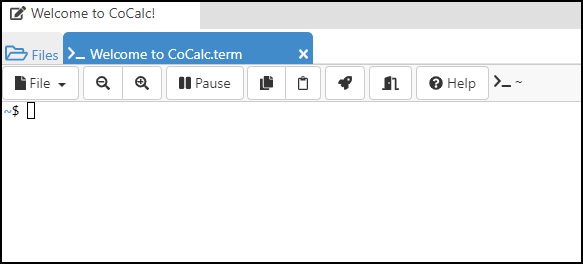
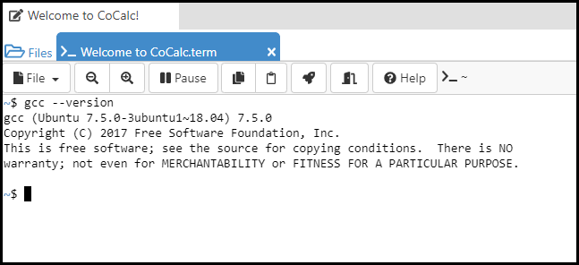
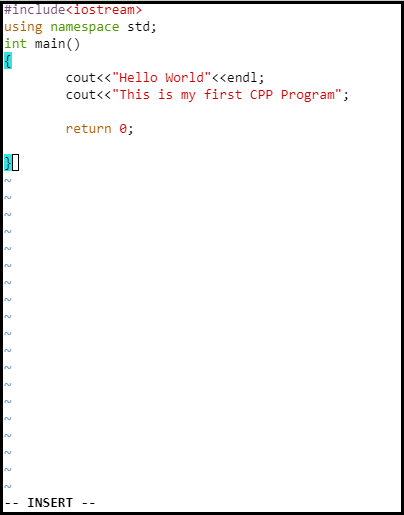
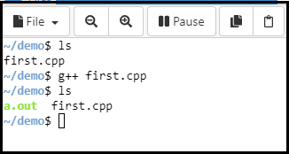
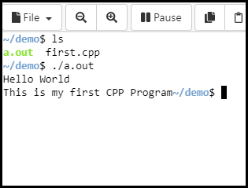

---
# **How to run a C++ program on Linux**

This is a basic tutorial that will help you run your first program in *C++* on *Linux* operating system. You do not need to have any prior programming knowledge.

As the tradition goes, we will also start, by writing a basic "Hello World" program that prints ***"Hello World"*** on the terminal. Here we will be using online Linux terminal CoCalc.
[Click here](https://cocalc.com/projects/263bbe96-def6-40a3-870b-30979041e7f1/files/?anonymous=terminal&session=default) to open the online terminal or you can open the terminal on your Linux PC

---
### **Step 1**
> **Open the terminal on your linux operating system.**
>
> **OR**
>
> **Open the online terminal.**

The online terminal will look like this 



---
### **Step 2**
> **Check if the *gcc compiler* is installed or not.**
 
Run the command given below:

**gcc --version**

This will show below result if the gcc compiler is already installed on your linux



Or it will show that you will need to install the compiler and it will also provide the command that you need to run, that will be:

**sudo apt install gcc**

---
### **Step 3**
> **Now create a "first.cpp" file inside a directory.**

We will create a directory inside the root folder and name it *"demo"*. First check the working directoy using the command-

**pwd**

Now create a directory called *demo* inside the root directory using the command given below:

**mkdir demo**

Go inside the directory using the command given below:

**cd ./demo**

Now create a cpp file ***(using vi editor)***, name the file *first.cpp* using the command given below::

**vi first.cpp**

Now enter **i** to insert into the file.

Now type the code as shown in below image



```cpp
#include<iostream>
using namespace std;
int main()
{
        cout<<"Hello World"<<endl;
        cout<<"This is my first CPP Program";

        return 0;

}
```

Now enter **esc** to enter command mode.

Now enter **:wq** to save and close the file.

---
### **Step 4**
> **Compiling the first.cpp file.**   

To compile the program run the command:

**g++ first.cpp**

> *This will generate an executable file **a.out** in the same directory*

We can view the file by listing all the files inside the directory using the command:

**ls**



---
### **Step 5**
> **Executing the a.out file.**

Now finally run the executable file using the command:

**./a.out**

> ***Final output will be as shown in the image.***

    
