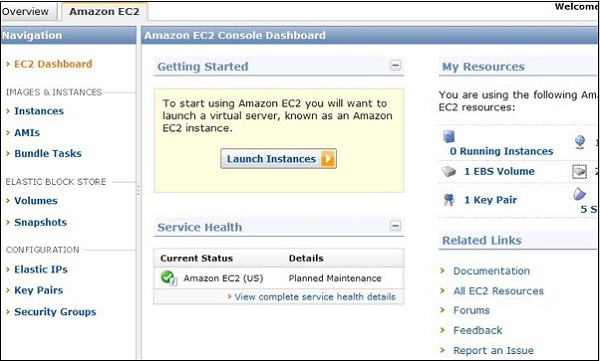

Assignment of AWS lectures

# AWS

Amazon Web Services **(AWS)** is Amazon’s cloud web hosting platform that offers flexible, reliable, scalable, easy-to-use, and cost-effective solutions.
It uses ***pay as you go model***, which means the user has to pay only for those services that he uses. And the bill is calculated only for the time when the services are running or active. There are a lot of services available on AWS some of which are discussed below.

### 1. **EC2 (Elastic Compute Cloud)**
It is a web service interface that provides resizable compute capacity in the AWS cloud. It is designed for developers to have complete control over web-scaling and computing resources.

EC2 instances can be resized and the number of instances scaled up or down as per our requirement. These instances can be launched in one or more geographical locations or regions, and **Availability Zones (AZs)**. Each region comprises of several AZs at distinct locations, connected by low latency networks in the same region.

### 2. **S3 (Simple Storage Service)**
S3 is a storage service offered by Amazon. It stands for simple storage service and provides cloud storage for various types of web development applications. Amazon employs the same infrastructure used by its e-commerce arm. S3 uses publicly available web interfaces like SOAP, REST and BitTorrent to provide storage service.

The S3 guarantees 99.9% of monthly uptime, which translates to 43 minutes of unavailability per month in the worst case scenario. It only mentions that S3 has an object durability of 99.999999999%.The S3 also uses an object storage architecture for the purpose of data management.

The S3 has been designed to store up to 5 terabytes of data, with metadata of 2 kilobytes attached to it.

#### ***Advantage of S3***
If the data is in the process of being modified, the PUTS command is used to read an object that will return older data for the same object. Because S3 implements data consistency across the board, it mitigates the chance of a corrupt or partial data-write. The same case applies for data that is in the process of deletion. If process is executed that attempts to read deleted data, the deleted data will be returned until it is completely removed.
